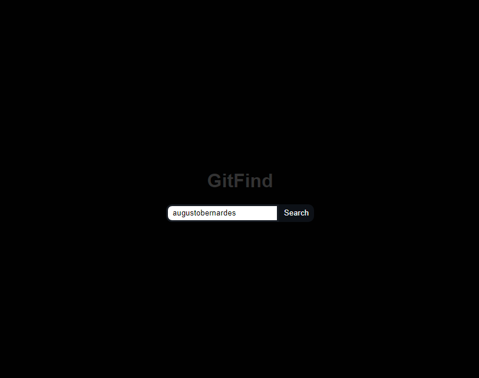
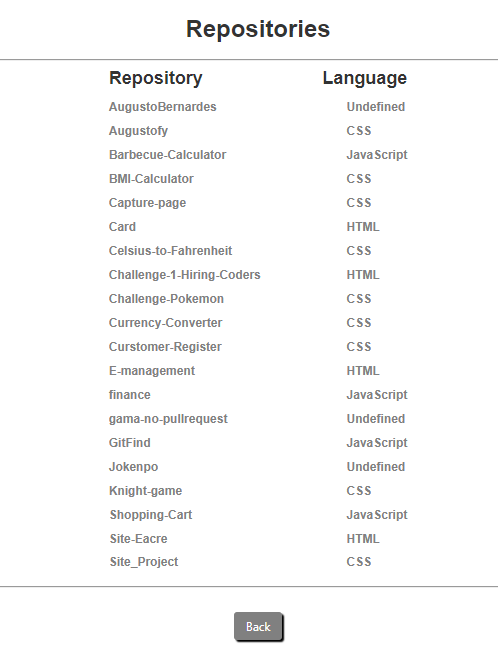

# GitFind 🔍

This project have the object to search on GitHub Api and return the repositories with the languages.
To check how it work just follow the link [Link](https://findinguser.netlify.app)

# Dependencies

```bash
  # Clone this repository
  $ git clone https://github.com/AugustoBernardes/GitFind
  
  # React router dom 
  $ npm install react-router-dom
  
  # The style component
  $ npm install styled-components
  
  # And axios
  $ npm install axios
```

# Design



